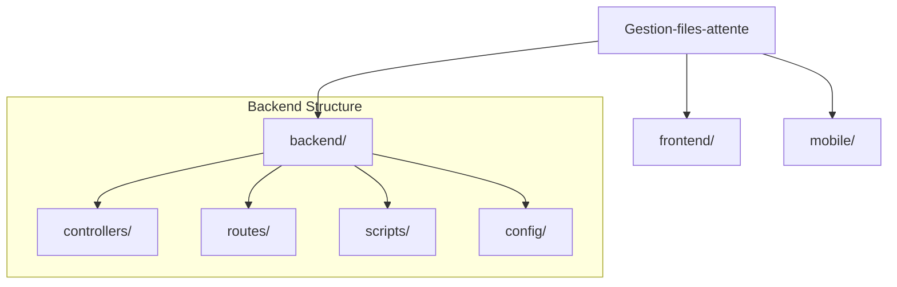
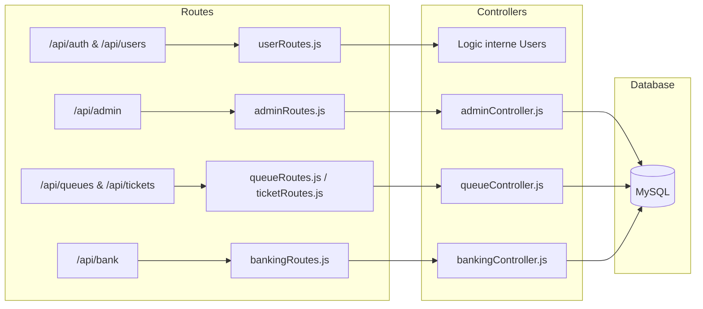

# 📊 Documentation Visuelle de l'Architecture Consolidée

Ce document présente la structure simplifiée et optimisée du projet après la consolidation des fichiers.

## 🏗️ Structure Globale

Le projet est divisé en trois parties principales, avec un backend maintenant beaucoup plus organisé :

## 🛣️ Flux des Routes & Contrôleurs (V2)

Les routes ont été regroupées par domaine logique pour réduire la fragmentation :

## 📉 Changements Majeurs (Avant vs Après)

| Composant | Ancienne Structure | Nouvelle Structure (Optimisée) |
| :--- | :--- | :--- |
| **Scripts** | Vrac à la racine (`test-*.js`) | Centralisés dans `backend/scripts/` |
| **Utilisateurs** | `authRoutes.js` + `userRoutes.js` | Unifié dans `userRoutes.js` |
| **Administration** | Éparpillé dans 3 fichiers | Regroupé dans `adminRoutes.js` |
| **Tickets/Files** | `ticketController.js` + `queueController.js` | Unifié dans `queueController.js` |
| **Données** | `seed.js` + `seed_v2.js` | Unifié et amélioré dans `seed.js` |

## 🚀 Utilisation des Scripts

Les scripts utilitaires sont maintenant situés dans `backend/scripts/`. Pour les lancer :

- **Tester l'Admin** : `node backend/scripts/test-admin.js`
- **Vérifier la DB** : `node backend/scripts/test-db.js`
- **Réinitialiser les données** : `node backend/config/seed.js`

> [!TIP]
> Cette nouvelle architecture réduit la redondance de code et facilite le débogage en limitant le nombre de fichiers à surveiller lors des modifications de logique métier.
